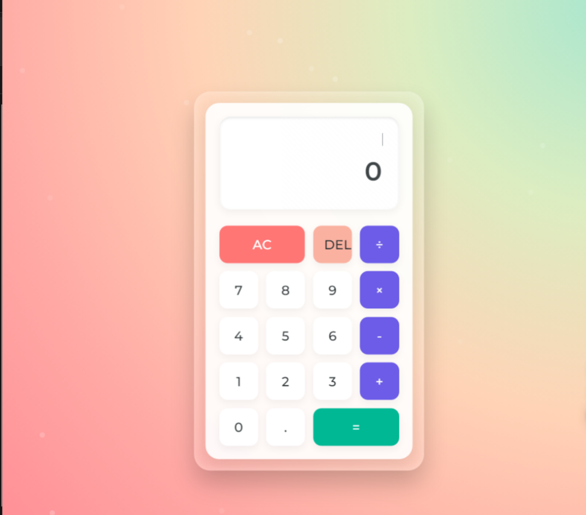

<div align="center">

# ✨ Elegant Calculator

<p align="center">
  
</p>

[](https://opensource.org/licenses/MIT)

### 🌈 A stunning calculator with glass-morphism design and fluid animations


</div>

---

<details>
<summary>📖 Table of Contents</summary>

- [✨ Overview](#-Overview)
- [🎥 Demo](#-demo)
- [⚡ preview](#-preview)
- [🛠️ Installation](#️-installation)
- [🎮 Usage](#-usage)
- [🎨 Customization](#-customization)
- [🤝 Contributing](#-contributing)
- [📝 License](#-license)
- [👏 Acknowledgments](#-acknowledgments)
</details>

## ✨ Overview

Elegant Calculator is not just another calculator – it's a beautifully crafted web application that combines functionality with stunning design. Featuring a modern glass-morphism UI, fluid animations, and a responsive layout, it transforms the mundane task of calculation into a delightful experience.

<div align="center">
<table>
<tr>
<td align="center">
<strong>🎨 Modern Design</strong>
<br>
Glass-morphism & Animations
</td>
<td align="center">
<strong>⚡ Fast & Responsive</strong>
<br>
Works on all devices
</td>
<td align="center">
<strong>⌨️ Keyboard Support</strong>
<br>
Type and calculate
</td>
</tr>
</table>
</div>

## 🎥 Demo

<p align="center">
  
</p>

## ⚡ preview

<div align="center">

</div>

### 🎨 Design Elements
- **Glass-morphism Effect**
  - Stunning transparent UI
  - Blur effects
  - Modern aesthetics
- **Dynamic Animations**
  - Floating calculator
  - Particle background
  - Button interactions
- **Responsive Layout**
  - Mobile-first design
  - Adapts to all screens
  - Touch-friendly interface

### 🔢 Calculator Functions
- **Core Operations**
  ```js
  + Addition
  - Subtraction
  × Multiplication
  ÷ Division
  ```
- **Special Features**
  - Decimal support
  - Clear (AC)
  - Delete (DEL)
  - Error handling

### ⌨️ Keyboard Shortcuts
| Key | Function |
|-----|----------|
| `0-9` | Input numbers |
| `+/-/*` | Operations |
| `Enter` | Calculate |
| `Escape` | Clear all |
| `Backspace` | Delete |

## 🛠️ Installation

```bash
# Clone this repository
git clone https://github.com/kunalsahu20/calculator.git

# Navigate to the project
cd calculator

# Open in browser
open index.html
```

## 🎮 Usage

### Mouse Controls
- Click numbers to input digits
- Click operators (+, -, ×, ÷) for calculations
- Use AC to clear all
- Use DEL to delete last digit
- Press = for result

### Keyboard Support
- Numbers (0-9) for input
- Operators (+, -, *, /)
- Enter or = for calculation
- Backspace for delete
- Escape for clear

## 🎨 Customization

### Color Themes
```css
/* In your CSS */
:root {
    --primary: #2d3436;    /* Main color */
    --accent: #00b894;     /* Highlight color */
    --background: #dfe6e9; /* Background color */
}
```

### Animation Settings
```css
/* Adjust animation speed */
.calculator {
    --float-speed: 6s;
    --particle-speed: 15s;
}
```

## 🤝 Contributing

<div align="center">

**👥 Contributing is what makes the open-source community amazing! 👥**

</div>

1. Fork the Project
2. Create your Feature Branch
   ```bash
   git checkout -b feature/AmazingFeature
   ```
3. Commit your Changes
   ```bash
   git commit -m '✨ Add some AmazingFeature'
   ```
4. Push to the Branch
   ```bash
   git push origin feature/AmazingFeature
   ```
5. Open a Pull Request

## 📝 License

<div align="center">

**Released under the MIT License ⚖️**

Built with ❤️ by [Kunal](https://github.com/kunalsahu20)

</div>

